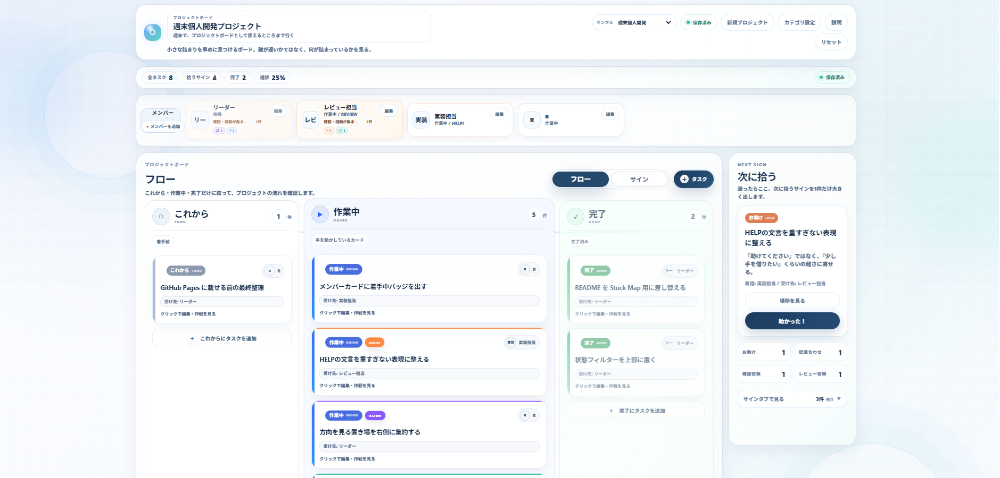

# Stuck Map

**Stuck Map** は、プロジェクト進行中の小さな詰まり・確認待ち・認識合わせ・レビュー依頼を、軽いサインとして置き、助け合いの流れを見つけやすくする進行支援ボードです。

> 誰が遅いかではなく、何が詰まっているかを見る。

タスクの進捗だけではなく、作業・確認・認識合わせ・レビュー・HELP の流れがどこで止まりそうかを早めに見つけることを目的にしています。

---

## Demo

https://ryohei0otsuka.github.io/stuck-map/

---

## Screenshot



---

## Concept

プロジェクトでは、タスクそのものの難しさだけでなく、確認待ち・判断待ち・レビュー待ち・相談しづらさによって進行が止まることがあります。

Stuck Map は、そうした小さな詰まりを、重い報告ではなく軽いサインとして置けるようにするためのプロトタイプです。

中心にある考え方は、次の3つです。

- 誰が遅いかではなく、何が詰まっているかを見る
- 人を責めるのではなく、流れが止まっている理由を見る
- HELPを増やすだけでなく、HELPの流れを整える

Stuck Map は、個人の遅れや生産性を監視するためのものではありません。

見る対象は、人ではなく、作業・確認・認識合わせ・レビュー・HELP の流れです。

また、Stuck Map の目線は、困っている人だけに向いているわけではありません。

助けてほしい人が小さくサインを出すためだけでなく、助けたい人がどこに入ればよいかを見つけるため、また確認・判断・権限・ファイル共有などが特定の人や場所に集まりすぎていないかを見るための地図でもあります。

---

## What Stuck Map Shows

Stuck Map では、タスクの状態を大きく2つに分けています。

### 1. フロー

タスクそのものの進行状態です。

| 表示 | 補助コード | 意味 |
|---|---|---|
| これから | TODO | まだ着手していないもの |
| 作業中 | DOING | 現在進めているもの |
| 完了 | DONE | 作業が終わったもの |

### 2. サイン

タスクに付けられる、確認・相談・支援の状態です。

| 表示 | 補助コード | 意味 |
|---|---|---|
| お助け | HELP | 少し手を借りたいもの |
| 確認依頼 | CHECK | 軽く確認してほしいもの |
| 認識合わせ | ALIGN | 方針や前提を合わせたいもの |
| レビュー依頼 | REVIEW | 一度見てほしいもの |

サインは、タスクを完了させるためのボタンではありません。

たとえば、`作業中` のタスクに `お助け` サインが付いている場合、そのタスクはフロー上では作業中のまま残り、サイン側では「お助け」として拾えるようになります。

サインを解消しても、タスク自体は完了にはなりません。  
タスクを完了させる場合は、フロー側または詳細画面で完了操作を行います。

---

## Features

- プロジェクト名・メモの編集
- メンバー管理
- メンバーごとの CAN HELP 表示
- タスクの追加・編集・削除
- タスクへのサイン追加
- フロー表示
- サイン表示
- 右パネルで「次に拾うサイン」を優先表示
- お助け / 確認依頼 / 認識合わせ / レビュー依頼の支援キュー表示
- タスクのドラッグ移動
- メンバークリックによる担当タスクへの移動
- カテゴリ管理
- サンプルプロジェクト切替
- 全タスク完了時の完遂表示
- localStorage による自動保存
- 初回説明モーダル

---

## Design Principles

### フローとサインを分ける

Stuck Map では、タスクの進行状態と、詰まり・確認・相談の状態を分けています。

- **フロー**：タスクそのものの進行
- **サイン**：詰まり・確認・認識合わせ・レビュー依頼

これにより、次のような状態を扱いやすくしています。

- 作業は進行中だが、確認だけ必要
- 完了ではないが、レビュー待ち
- 止まってはいないが、前提を合わせたい
- 誰かが少し拾えば流れる

---

### 助けてほしい人だけでなく、助けたい人も見る

Stuck Map は、困っている人がサインを出すだけのボードではありません。

手は空いている。  
助けたい。  
でも、どこに入ればよいか分からない。  
ファイルがない。権限がない。入口がない。

そうした「助けたいけれど入れない」状態も、プロジェクトの流れを止める要因になります。

Stuck Map では、HELP / CHECK / ALIGN / REVIEW のサインと、メンバーの CAN HELP 表示を通じて、助けてほしい側だけでなく、助けたい側が次に入れる場所を見つけやすくすることを目指しています。

---

### 人ではなく、流れを見る

Stuck Map が見たいのは、誰が悪いかではなく、何が動かないから止まっているのかです。

たとえば、ファイル共有待ち、権限待ち、判断待ち、相手アクション待ち、確認の集中などは、外から見ると単なる「待機」や「指示待ち」に見えることがあります。

Stuck Map では、それらを「Aさん待ち」のように人へ寄せず、

- ファイル共有待ち
- 判断待ち
- 権限確認待ち
- 確認集中の可能性
- 共有元集中の可能性

のように、状態として扱うことを重視します。

人ではなく、流れを見る。  
誰かを責めるのではなく、助け合いが止まっている理由を見つけるための地図です。

---

### 集中している人を責めずに、集中している状態を見る

プロジェクトでは、判断・確認・ファイル共有・権限・レビューが、特定の人に集まりすぎることがあります。

その人が悪いわけではありません。  
むしろ、詳しい人・責任を持っている人・確認できる人に、自然と集まってしまうことがあります。

Stuck Map では、タスク過重者を責めるのではなく、

- 判断が一か所に集まっていないか
- 確認が特定の人に偏っていないか
- ファイルや権限の入口が一人に寄っていないか
- 助けたい人が入れる余地があるか

といった、流れの偏りを見ることを重視します。

---

### HELPを増やすだけでなく、HELPの流れを整える

Stuck Map は、単に「助けて」と言いやすくするだけのツールではありません。

確認や相談が特定の人に集まり続ける場合、それは個人の問題ではなく、チームの流れや役割分担、手順の共有不足が原因かもしれません。

目的は、HELPを増やすことではありません。

**HELPの流れを整え、特定の人に集中しすぎないようにすること** です。

---

## Sample Projects

公開用サンプルとして、以下のプロジェクト例を用意しています。

- Web改修 公開準備
- 業務システム導入
- 採用ページ更新
- 新人オンボーディング

これらはすべて架空のサンプルです。  
実在の会社名、個人名、顧客名、案件名、機密情報、個人情報は含めない方針です。

---

## Usage

```bash
npm install
npm run dev
```

ビルド確認を行う場合は以下を実行します。

```bash
npm run build
```

---

## Tech Stack

- React
- Vite
- JavaScript
- CSS
- localStorage
- GitHub Pages

---

## Current Scope

現在の Stuck Map は、ブラウザの `localStorage` にデータを保存するプロトタイプです。

そのため、以下のような用途を想定しています。

- ポートフォリオ用のデモ
- 個人での試用
- プロトタイプ検証
- UI / UX の確認
- チーム進行支援アイデアの共有
- 朝会・定例・引き継ぎでの会話材料

現時点では以下には対応していません。

- ログイン
- 複数端末同期
- チーム共有
- リアルタイム同期
- 権限管理
- 履歴保存
- サーバーDB保存

実運用サービスとして使う場合は、認証、DB、権限管理、バックアップなどの追加設計が必要です。

---

## Positioning

Stuck Map は、既存のタスク管理や課題管理の仕組みを置き換えるものではありません。

Stuck Map が扱いたいのは、その前段階です。

正式な課題として登録するほど整理されていないけれど、

- 少し聞きづらい
- 確認したい
- 認識を合わせたい
- レビューしてほしい
- 誰に聞けばよいか分からない
- 何待ちなのか分からない
- HELPを出すには少し重い
- 助けたいが、どこに入ればよいか分からない
- 自分側は準備済みだが、相手の行動やファイル共有待ちで止まっている
- 判断や確認が特定の人に集まりすぎている
- 助けたい人はいるのに、入れる場所が分からない

といった小さな詰まりを、軽いサインとして置けるようにすることを目的としています。

既存のタスク管理を置き換えるのではなく、そこに載る前の違和感や確認待ち、助け合いが成立しにくい理由を拾うための補助ボードです。

---

## Roadmap

今後追加・検討したい機能です。  
現在は、機能拡張よりも UI 整理と挙動の安定化を優先しています。

### 近く検討したいこと

- 拾ったサインの軽い記録
- 誰でもOKサインを誰が拾ったか分かる仕組み
- 詰まり理由の整理表示
- ファイル待ち・権限待ち・判断待ちなどの分類
- サインの受け先分類
- ナレッジ化候補の表示
- チーム用テンプレート
- ホワイトボードモード

### 慎重に検討したいこと

- HELPの局所集中検知
- 助けたい側・助けられない側・タスク過重者を責めずに見られる表現
- コメント
- 履歴保存

### 将来的な技術検証

- 複数プロジェクト管理
- DB保存
- 複数人で同じ盤面を見る仕組み
- リアルタイム同期
- 同じ盤面を開くためのURL
- 権限管理

ただし、監視感が強くなる機能は慎重に扱います。

特に、個人別の負荷グラフや生産性スコアのような機能は、Stuck Map の思想とは相性が悪い可能性があります。  
Stuck Map が見たいのは、誰が遅いかではなく、何が詰まっているかです。

---

## Current Focus

現在は、機能追加よりも UI 整理と挙動の安定化を優先しています。

特に、

- 進捗とサインを混ぜない
- タスク追加を軽くする
- サイン追加時の導線を分かりやすくする
- 右パネルで「次に拾うサイン」を分かりやすくする
- 画面を見て3秒で「今どこが詰まっているか」が分かる状態に近づける
- 説明文を増やしすぎず、使う画面として整える

ことを重視しています。

---

## License

MIT License

Copyright (c) 2026 Ryohei Otsuka