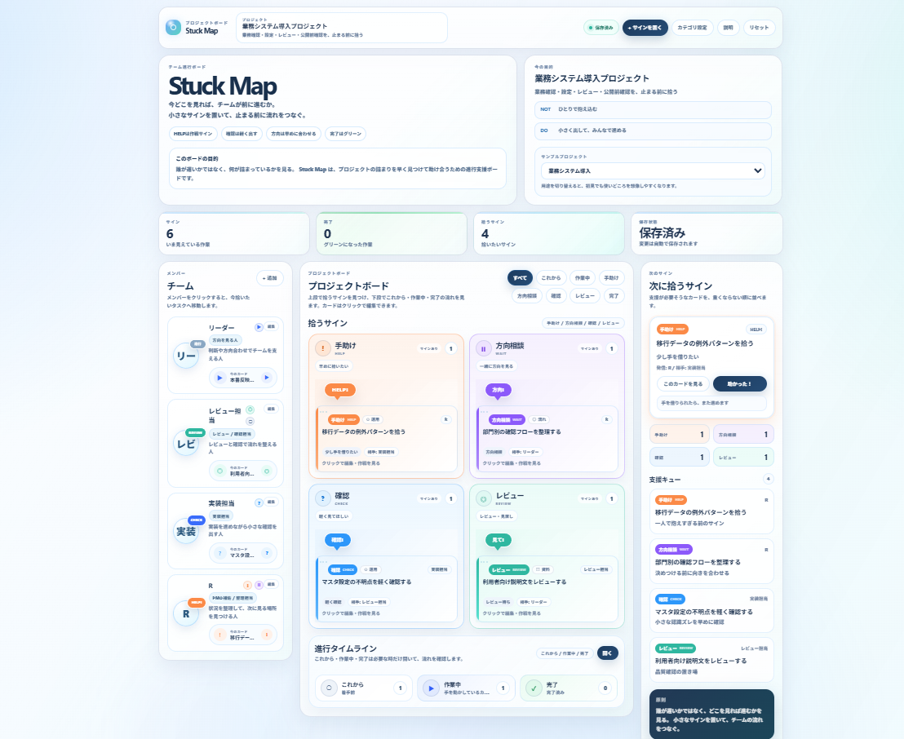

# Stuck Map

Stuck Map は、プロジェクトの「詰まり」を早めに見つけて、チームで助け合うための進行支援ボードです。

**誰が遅いかではなく、何が詰まっているかを見る。**

タスクの進捗だけではなく、確認したいこと、少し手を借りたいこと、方向を合わせたいこと、レビューしてほしいことを、軽いサインとして可視化します。

## 公開ページ

https://ryohei0otsuka.github.io/stuck-map/



---

## 背景

Stuck Map は、忙しい上司や先輩に声をかけづらく、確認待ちのまま作業が止まってしまう課題から着想したチーム進行支援ボードです。

プロジェクトでは、タスクの難しさだけでなく、質問しづらさ、判断待ち、確認漏れ、レビュー待ち、属人化などの「見えない詰まり」によって進行が止まることがあります。

こうした詰まりは、必ずしも誰か一人の努力不足で起きるものではありません。

相談のきっかけが重いこと、確認待ちが共有されにくいこと、判断が特定の人に集まりやすいことなど、チームの構造や運用の中で起きる問題でもあります。

Stuck Map は、そうした詰まりを **手助け**、**方向相談**、**確認**、**レビュー** などの軽いサインで可視化し、チームで早めに助け合える状態を作ることを目的としています。

このツールの中心思想は、

**誰が遅いかではなく、何が詰まっているかを見る。**

です。

個人の遅れを監視するのではなく、プロジェクト完遂のために、確認・相談・判断待ちを早めに共有するためのプロトタイプです。

---

## Stuck Map で見えるもの

Stuck Map では、タスクを単なる進捗状態ではなく、チームが次に拾いやすいサインとして整理します。

主な表示は日本語を中心にしています。  
英字コードは、内部ステータスや補助表示として使っています。

### 基本の流れ

- **これから**  
  まだ着手していないもの。補助コードは `TODO`。

- **作業中**  
  現在進めているもの。補助コードは `DOING`。

- **完了**  
  作業が終わったもの。補助コードは `DONE`。

### 拾いたいサイン

- **手助け**  
  少し手を借りたいもの。補助コードは `HELP`。

- **方向相談**  
  方針や判断を合わせたいもの。補助コードは `WAIT`。

- **確認**  
  軽く確認してほしいもの。補助コードは `CHECK`。

- **レビュー**  
  一度見てほしいもの。補助コードは `REVIEW`。

特に **手助け**、**方向相談**、**確認**、**レビュー** は、作業者を責めるためのラベルではありません。

チームが早めに気づき、必要な支援を届けるためのサインです。

---

## 主な機能

- プロジェクト名・メモの編集
- メンバー管理
- タスク / サインの追加・編集・削除
- ステータス別の表示
- 「拾うサイン」の優先表示
- 手助け / 方向相談 / 確認 / レビューの支援キュー表示
- タスクのドラッグ移動
- メンバークリックによる担当タスクへの移動
- カテゴリ管理
- サンプルプロジェクト切替
- localStorage による自動保存
- 初回説明モーダル
- README / 説明パネルによるコンセプト表示

---

## サンプルプロジェクト

公開用サンプルとして、以下のプロジェクト例を用意しています。

- 週末個人開発プロジェクト
- 業務システム導入プロジェクト
- Webサイト改修プロジェクト
- 新人オンボーディングプロジェクト

これらはすべて架空のサンプルです。  
実在の会社名、個人名、顧客名、案件名、機密情報、個人情報は含めない方針です。

---

## 使い方

```bash
npm install
npm run dev
```

ビルド確認を行う場合は以下を実行します。

```bash
npm run build
```

---

## 開発環境

- React
- Vite
- JavaScript
- CSS
- localStorage

---

## このプロトタイプで大切にしたこと

### 1. 相談のハードルを下げる

Stuck Map では、「助けてください」と大きく言う前に、軽く **手助け** のサインを置けることを大切にしています。

実務では、質問や相談の内容が小さいほど、かえって声をかけるタイミングに迷うことがあります。  
忙しそうな人に話しかけづらい、まだ自分で考えるべきか迷う、こんなことで止めていいのか不安になる。

そうした小さな迷いを、重い報告ではなく、軽いサインとして置けるようにすることで、詰まりが大きくなる前に拾える状態を目指しました。

### 2. 人ではなく、詰まりを見る

Stuck Map は、誰かの遅れを責めるためのものではありません。

見る対象は、人ではなく、作業・判断・確認・レビューの流れです。

「誰が遅れているか」ではなく、  
「どこで確認が止まっているか」  
「どこに判断が集まっているか」  
「どの作業が一人では進みにくくなっているか」  
を見るためのボードとして設計しています。

### 3. 判断待ちや確認待ちを早めに見えるようにする

プロジェクトでは、作業中のタスクだけでなく、判断待ち・確認待ち・レビュー待ちが流れを止めることがあります。

しかし、それらは進捗会議まで表面化しなかったり、本人の中で抱え込まれたりしがちです。

Stuck Map では、**方向相談**、**確認**、**レビュー** といった状態をあらかじめ置けるようにすることで、止まりそうな場所を早めに見つけられるようにしました。

### 4. 忙しい人への集中を構造として見る

確認や判断が同じ人に集まると、その人が悪いわけではなくても、プロジェクト全体の流れが止まりやすくなります。

Stuck Map では、そうした状態を個人の負荷として責めるのではなく、チームの流れや役割分担のサインとして見ます。

たとえば、同じ種類の確認が繰り返されているなら、手順書化できるかもしれません。  
同じ場所で方向相談が続いているなら、判断基準を共有できるかもしれません。

詰まりを見つけることを、責任追及ではなく、改善のきっかけにすることを意識しました。

### 5. 進捗会議の前に、小さな詰まりを拾う

Stuck Map は、問題が大きくなってから報告するためのものではありません。

日々の作業の中で、少し確認したいこと、方向を合わせたいこと、誰かに見てほしいことを軽く置き、チームが早めに拾える状態を作ることを目指しています。

進捗会議で初めて問題が見えるのではなく、普段の流れの中で小さな詰まりを共有できること。

それが、このプロトタイプで大切にしたことです。

---

## 今後追加したい機能

- クイック手助け投稿
- 拾ったサインの軽い記録
- 詰まり理由の整理表示
- ナレッジ化候補の表示
- チーム用テンプレート
- ホワイトボードモード

ただし、監視感が強くなる機能は慎重に扱います。

特に、個人別の負荷グラフや生産性スコアのような機能は、Stuck Map の思想とは相性が悪い可能性があります。

---

## 位置づけ

Stuck Map は、既存のタスク管理ツールを置き換えるものではありません。

正式な課題として管理する前の、小さな違和感・確認待ち・判断待ち・相談したいことを拾うための補助ボードです。

タスクを管理するだけでなく、プロジェクトが止まりそうな場所を早めに見つけることを目的としています。

---

## ライセンス

このリポジトリはポートフォリオ用のプロトタイプです。